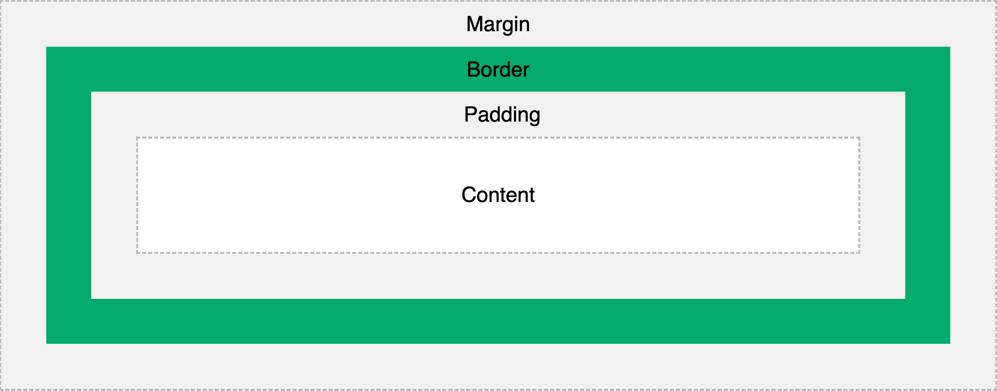

# CSS

## Introduction

- CSS stands for Cascading Style Sheets
- CSS describes how HTML elements are to be displayed on screen, paper, or in other media

## Role

HTML was created to describe the content of a web page

When tags like <font>, and color attributes were added to the HTML 3.2 specification, it started a nightmare for web developers. 

## Syntax

A CSS rule consists of a selector and a declaration block.


The selector points to the HTML element you want to style.

The declaration block contains one or more declarations separated by semicolons.

Each declaration includes a CSS property name and a value, separated by a colon.

Multiple CSS declarations are separated with semicolons, and declaration blocks are surrounded by curly braces.

```css
p {
  color: red;
  text-align: center;
}
```
- `p` is a selector in CSS (it points to the HTML element you want to style: <p>).
- color is a property, and red is the property value
- text-align is a property, and center is the property value

## Selector

A CSS selector selects the HTML element(s) you want to style.

CSS selectors are used to "find" (or select) the HTML elements you want to style.

We can divide CSS selectors into five categories:
- Simple selectors (select elements based on name, id, class)
- Combinator selectors (select elements based on a specific relationship between them)
- Pseudo-class selectors (select elements based on a certain state)
- Pseudo-elements selectors (select and style a part of an element)
- Attribute selectors (select elements based on an attribute or attribute value)

### The CSS id Selector

To select an element with a specific id, write a hash (#) character, followed by the id of the element.

The CSS rule below will be applied to the HTML element with id="para1": 

```css
#para1 {
  text-align: center;
  color: red;
}
```
### The CSS class Selector

To select elements with a specific class, write a period (.) character, followed by the class name.

In this example, all HTML elements with class="center" will be red and center-aligned: 

```css
.center {
  text-align: center;
  color: red;
}
```

You can also specify that only specific HTML elements should be affected by a class.

In this example, only <p> elements with class="center" will be red and center-aligned:

```css
p.center {
  text-align: center;
  color: red;
}
```

### The CSS Grouping Selector

The grouping selector selects all the HTML elements with the same style definitions.

To group selectors, separate each selector with a comma.

```css
h1, h2, p {
  text-align: center;
  color: red;
}
```

## Three Ways to Insert CSS

There are three ways of inserting a style sheet:

- External CSS
- Internal CSS
- Inline CSS

### External CSS

With an external style sheet, you can change the look of an entire website by changing just one file!

Each HTML page must include a reference to the external style sheet file inside the <link> element, inside the head section.

```html
<!DOCTYPE html>
<html>
<head>
<link rel="stylesheet" href="mystyle.css">
</head>
```

An external style sheet can be written in any text editor, and must be saved with a .css extension.

The external .css file should not contain any HTML tags.

```css
body {
  background-color: lightblue;
}

h1 {
  color: navy;
  margin-left: 20px;
}
```

### Internal CSS

An internal style sheet may be used if one single HTML page has a unique style.

The internal style is defined inside the <style> element, inside the head section.

```html
<!DOCTYPE html>
<html>
<head>
<style>
body {
  background-color: linen;
}

h1 {
  color: maroon;
  margin-left: 40px;
}
</style>
</head>
```

### Inline CSS

An inline style may be used to apply a unique style to a single element.

To use inline styles, add the style attribute to the relevant element. The style attribute can contain any CSS property.

```html
<!DOCTYPE html>
<html>
<body>

<h1 style="color:blue;text-align:center;">This is a heading</h1>
<p style="color:red;">This is a paragraph.</p>

</body>
</html>
```

### Cascading Order

If some properties have been defined by the same selector (element) in different style sheets, the value from the last read style sheet will be used. 

All the styles on a page will "cascade" into a new "virtual" style sheet by the following rules, where number one has the highest priority:

1. Inline style (inside an HTML element)
2. External and internal style sheets (in the head section)
3. Browser default

## CSS Comments

A CSS comment starts with /* and ends with */:

```css
/* This is a single-line comment */
p {
  color: red;
}
```

## CSS Colors

Colors are specified using predefined color names, or RGB, HEX, HSL, RGBA, HSLA values.

### CSS Background Color

```html
<h1 style="background-color:DodgerBlue;">Hello World</h1>
```

### CSS Text Color

```html
<h1 style="color:Tomato;">Hello World</h1>
```

### CSS Border Color

```html
<h1 style="border:2px solid Tomato;">Hello World</h1>
```

### CSS Color Values

In CSS, colors can also be specified using RGB values, HEX values, HSL values, RGBA values, and HSLA values:

```html
<h1 style="background-color:rgb(255, 99, 71);">...</h1>
<h1 style="background-color:#ff6347;">...</h1>
<h1 style="background-color:hsl(9, 100%, 64%);">...</h1>
```

## CSS Backgrounds

### CSS background-color

The background-color property specifies the background color of an element.

```css
body {
  background-color: lightblue;
}
```

### Opacity / Transparency

The opacity property specifies the opacity/transparency of an element. It can take a value from 0.0 - 1.0. The lower value, the more transparent:

```css
div {
  background-color: green;
  opacity: 0.3;
}
```

### Transparency using RGBA

```css
div {
  background: rgba(0, 128, 0, 0.3) /* Green background with 30% opacity */
}
```

## CSS Border

### CSS Border Style

```css
p.dotted {border-style: dotted;}
p.dashed {border-style: dashed;}
p.solid {border-style: solid;}
p.double {border-style: double;}
p.groove {border-style: groove;}
p.ridge {border-style: ridge;}
p.inset {border-style: inset;}
p.outset {border-style: outset;}
p.none {border-style: none;}
p.hidden {border-style: hidden;}
p.mix {border-style: dotted dashed solid double;}
```


### CSS Border Width

The border-width property can have from one to four values (for the top border, right border, bottom border, and the left border):

Four values are assigned to four sides clockwise. If one value is missing, get the value from the value of its symmetrical side. 
If symmetrical value is missing as well, get the value from previous one.

```css
p.one {
  border-style: solid;
  border-width: 5px; /* 5px for top bottom left right */
}

p.two {
  border-style: solid;
  border-width: 5px 10px; /* 5px top and bottom, 10px on the sides */
}

p.three {
  border-style: solid;
  border-width: 5px 10px 15px; /* 5px top, 10px for right, 15 for bottom */
}
p.four {
    border-style: solid;
    border-width: 5px 10px 15px 20px; /* 5px top, 10px for right, 15 for bottom, 20 for left */
}
```

### CSS Border Color

The border-color property is used to set the color of the four borders.

The border-color property can have from one to four values (for the top border, right border, bottom border, and the left border). 

Four values are assigned to four sides clockwise. If one value is missing, get the value from the value of its symmetrical side.
If symmetrical value is missing as well, get the value from previous one.

```css
p.one {
  border-style: solid;
  border-color: red green blue yellow; /* red top, green right, blue bottom and yellow left */
}
```

### CSS Border Sides

In CSS, there are also properties for specifying each of the borders (top, right, bottom, and left):

```css
p {
  border-top-style: dotted;
  border-right-style: solid;
  border-bottom-style: dotted;
  border-left-style: solid;
}
```

The example above gives the same result as this:

```css
p {
  border-style: dotted solid;
}
```

### CSS Border - Shorthand Property

The border property is a shorthand property for the following individual border properties:

- border-width
- border-style (required)
- border-color

```css
p {
  border: 5px solid red;
}
```

### CSS Rounded Borders

The border-radius property is used to add rounded borders to an element:

```css
p {
  border: 2px solid red;
  border-radius: 5px;
}
```

## CSS Margins

Margins are used to create space around elements, outside of any defined borders.

### Margin - Individual Sides

CSS has properties for specifying the margin for each side of an element:

- margin-top
- margin-right
- margin-bottom
- margin-left

All the margin properties can have the following values:

- auto : the browser calculates the margin
- length : specifies a margin in px, pt, cm, etc.
- % : specifies a margin in % of the width of the containing element
- inherit : specifies that the margin should be inherited from the parent element

### Margin - Shorthand Property

The margin property is a shorthand property for the following individual margin properties:

- margin-top
- margin-right
- margin-bottom
- margin-left

### The auto Value

You can set the margin property to auto to horizontally center the element within its container.

The element will then take up the specified width, and the remaining space will be split equally between the left and right margins.

### CSS Margin Collapse

Top and bottom margins of elements are sometimes collapsed into a single margin that is equal to the largest of the two margins.

This does not happen on left and right margins! Only top and bottom margins!

```css
h1 {
  margin: 0 0 50px 0;
}

h2 {
  margin: 20px 0 0 0;
}
```

In this example the h1 element has a bottom margin of 50px and the h2 element has a top margin of 20px. So, the vertical margin between h1 and h2 should have been 70px (50px + 20px). However, due to margin collapse, the actual margin ends up being 50px.

## CSS Padding

Padding is used to create space around an element's content, inside of any defined borders.

### Padding - Individual Sides

CSS has properties for specifying the padding for each side of an element:

- padding-top
- padding-right
- padding-bottom
- padding-left

All the padding properties can have the following values:

- length: specifies a padding in px, pt, cm, etc.
- %: specifies a padding in % of the width of the containing element
- inherit: specifies that the padding should be inherited from the parent element

### Padding - Shorthand Property

top-right-bottom-left(clockwise)

### Padding and Element Width

The CSS width property specifies the width of the element's content area. The content area is the portion inside the padding, border, and margin of an element (the box model).

So, if an element has a specified width, the padding added to that element will be added to the total width of the element. This is often an undesirable result.

Here, the <div> element is given a width of 300px. However, the actual width of the <div> element will be 350px (300px + 25px of left padding + 25px of right padding):

```css
div {
    width: 300px;
    padding: 25px;
}
```

To keep the width at 300px, no matter the amount of padding, you can use the box-sizing property. This causes the element to maintain its actual width; if you increase the padding, the available content space will decrease.

```css
div {
  width: 300px;
  padding: 25px;
  box-sizing: border-box;
}
```

## CSS Height, Width and Max-width

The CSS height and width properties are used to set the height and width of an element.

The CSS max-width property is used to set the maximum width of an element.

The height and width properties do not include padding, borders, or margins. It sets the height/width of the area inside the padding, border, and margin of the element.

## CSS Box Model

In CSS, the term "box model" is used when talking about design and layout.

The CSS box model is essentially a box that wraps around every HTML element. It consists of: margins, borders, padding, and the actual content. The image below illustrates the box model:



Explanation of the different parts:

- Content: The content of the box, where text and images appear
- Padding: Clears an area around the content. The padding is transparent
- Border: A border that goes around the padding and content
- Margin: Clears an area outside the border. The margin is transparent

### Width and Height of an Element

Important: When you set the width and height properties of an element with CSS, you just set the width and height of the content area. To calculate the full size of an element, you must also add padding, borders.

```
Actual width = element width + left padding width+ right padding width + left border width + right border width
Acutal height = element height + top padding height+ bottom padding height + top border height + bottom border height
```

## CSS Outline

An outline is a line that is drawn around elements, OUTSIDE the borders, to make the element "stand out".


CSS has the following outline properties:

- outline-style
- outline-color
- outline-width
- outline-offset
- outline

> Note: Outline differs from borders! Unlike border, the outline is drawn outside the element's border, and may overlap other content. Also, the outline is NOT a part of the element's dimensions; the element's total width and height is not affected by the width of the outline.

## Text

### Text Color and Background Color

```css
div {
  background-color: blue;
  color: white;
}
```

### Text Alignment and Text Direction

- text-align
- text-align-last
- direction
- unicode-bidi
- vertical-align

[TBC](https://www.w3schools.com/css/css_text_align.asp)

